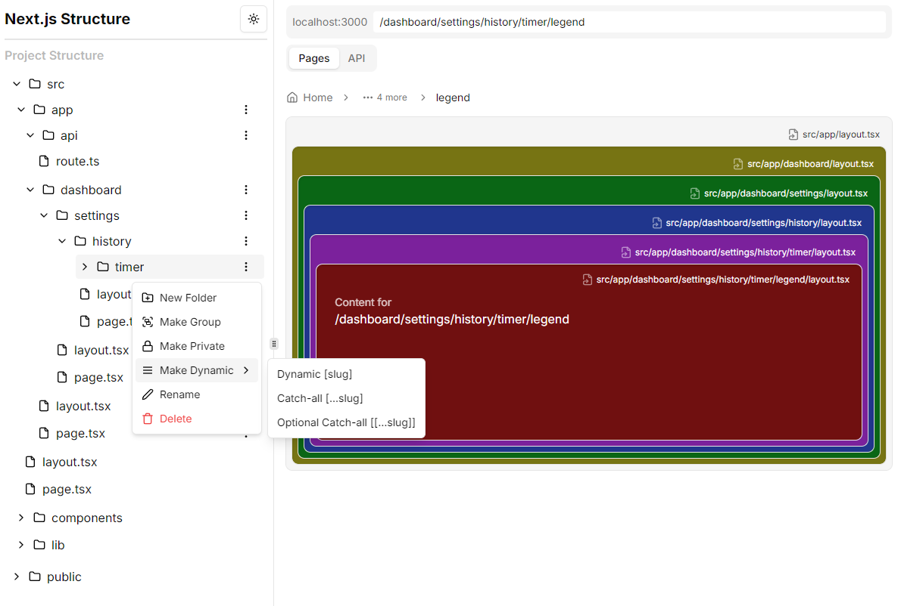

# Next.js Project Structure Playground

An interactive web application that helps visualize and understand Next.js project structures. This tool allows you to explore and manipulate Next.js app directory structures with a visual interface.



## Features

- **Visual File Structure**: Interactive tree view of your Next.js project structure
- **Layout Visualization**: Nested layout visualization with custom styling support
- **Route Management**:
  - Static routes
  - Dynamic routes
  - Catch-all routes
  - Optional catch-all routes
  - Route groups
  - Private routes
  - Parallel routes (coming soon)
  - Intercepted routes (coming soon)
- **File Operations**:
  - Add new folders and files
  - Rename files and folders
  - Delete files and folders
  - Customize layout styles with color picker
- **Real-time Preview**: See how your routes and layouts work together
- **API Route Support**: Dedicated view for API routes
- **Modern UI**: Built with shadcn/ui components and Tailwind CSS

## Tech Stack

- Next.js 15
- TypeScript
- Tailwind CSS
- shadcn/ui Components
- Framer Motion for animations
- Context API for state management

## Getting Started

1. Clone the repository:

```bash
git clone https://github.com/buraketmen/nextjs-project-structure.git
```

2. Install dependencies:

```bash
npm install
# or
yarn install
# or
pnpm install
```

3. Run the development server:

```bash
npm run dev
# or
yarn dev
# or
pnpm dev
```

4. Open [http://localhost:3000](http://localhost:3000) with your browser to see the result.

## Usage

1. **Exploring Structure**: Use the file tree on the left to navigate through your project structure
2. **Adding Files/Folders**: Right-click on folders to add new files or folders
3. **Customizing Layouts**: Click the settings icon on layout files to customize their appearance
4. **Previewing Routes**: Select any page file to see how it appears with its parent layouts
5. **API Routes**: API routes are automatically detected and shown in a dedicated tab
